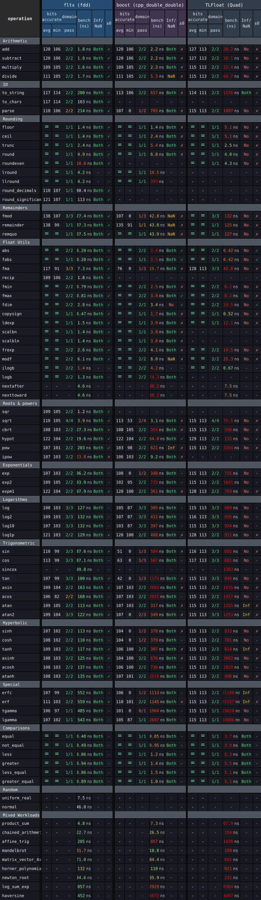
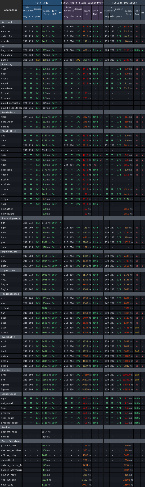

<p align="center">
  <br>
  Extended-precision floating point math library<br>
  Fast · Precise · Lightweight
</p>


[](https://github.com/bitloop-dev/fltx/actions/workflows/tests.yml)

`fltx` is a high-performance C++ library for double-double and quad-double arithmetic, with a broad std-style math library and extensive constexpr support throughout.

## Menu

- [Overview](#highlights): highlights and core types
- [Get Started](#quick-start): quick start and installation
- [Library Guide](#public-headers): headers, numeric types, math, and IO
- [Advanced Features](#template-dispatch): template dispatch
- [Development](#building-and-testing-fltx): building and testing fltx
- [Project Details](#benchmarks-and-metrics): benchmarks, implementation notes, and license

## Highlights

Features:

- Fixed-size extended-precision scalar types: [`bl::fdd`](include/fltx/fdd.h) and [`bl::fqd`](include/fltx/fqd.h)
- Library-wide **constexpr** support for math, parsing, static formatting, and conversions
- Familiar `std::` style APIs; many call sites can be migrated by simply swapping `std::` for `bl::`
- No required runtime dependencies
- Standard-library integration for streams, manipulators, `std::numeric_limits`, `std::numbers`, `std::hash`, and `std::format`

Accuracy:

- Accuracy validated against [Boost.Multiprecision's MPFR backend](https://www.boost.org/doc/libs/latest/libs/multiprecision/doc/html/boost_multiprecision/tut/floats/mpfr_float.html)
- Correct handling of infinities, NaNs and signed zeros (non-fast-math builds)
- Extreme-range arithmetic follows a deliberate [range/performance policy](#range-and-performance-policy)

Performance:

- Optimised for runtime and constexpr performance, with predictable build-time and binary-size scaling
- Compatible with fast-math builds
- Internal [`bl::fqd`](include/fltx/fqd.h) expression fusion reduces intermediate rounding and temporary value materialisation for common arithmetic shapes
- Hardware acceleration where supported, including SSE2 on x86-64, FMA where available, AArch64 NEON, and WebAssembly SIMD128 via Emscripten
- Suitable for lightweight native and WebAssembly builds
- Optional dispatch helper that maps runtime choices to template specialisations

## Core Types

| Type | Representation | Precision |
|---|---|---|
| [`bl::f32`](include/fltx/aliases.h) | Alias for native [`float`](https://en.cppreference.com/w/cpp/language/types) | Native [`float`](https://en.cppreference.com/w/cpp/language/types) precision |
| [`bl::f64`](include/fltx/aliases.h) | Alias for native [`double`](https://en.cppreference.com/w/cpp/language/types) | Native [`double`](https://en.cppreference.com/w/cpp/language/types) precision |
| [`bl::fdd`](include/fltx/fdd.h) | Double-double | 106 bits (~31 significant decimal digits) |
| [`bl::fqd`](include/fltx/fqd.h) | Quad-double | 212 bits (~63 significant decimal digits) |


## Quick Start

```cpp
#include <iostream>
#include <iomanip>

#include <fltx.h>
using namespace bl::types;
using namespace bl::literals;

int main()
{
    constexpr fqd a = 1_qd / 3_qd;
    constexpr fqd b = 2_qd / 3_qd;
    constexpr fqd c = a + b;
    constexpr fqd d = bl::atan2(a, b);

    std::cout
        << std::fixed
        << std::setprecision(std::numeric_limits<fqd>::digits10)
        << "a           = " << a << "\n"
        << "b           = " << b << "\n"
        << "a + b       = " << c << "\n"
        << "atan2(a, b) = " << d << "\n";
}
```

Output:

```text
a           = 0.333333333333333333333333333333333333333333333333333333333333333
b           = 0.666666666666666666666666666666666666666666666666666666666666667
a + b       = 1.000000000000000000000000000000000000000000000000000000000000000
atan2(a, b) = 0.463647609000806116214256231461214402028537054286120263810933089
```

<details>
<summary><strong>More examples</strong></summary>
  
| Example | Shows |
|---|---|
| [`example_basic.cpp`](examples/example_basic.cpp) | Basic `fdd` / `fqd` arithmetic, literals, and output. |
| [`example_constexpr_io.cpp`](examples/example_constexpr_io.cpp) | Compile-time parsing, formatting, and string conversion. |
| [`example_dispatch.cpp`](examples/example_dispatch.cpp) | Generic code dispatching across `fltx` precision types. |
| [`example_mandelbrot.cpp`](examples/example_mandelbrot.cpp) | Higher-precision numeric work in a small visual workload. |
| [`example_consteval_ellipse.cpp`](examples/example_consteval_ellipse.cpp) | Consteval geometry using `fltx` math. |
| [`example_consteval_library_sweep.cpp`](examples/example_consteval_library_sweep.cpp) | Library-wide constexpr coverage across the supported function groups. |
| [`example_random.cpp`](examples/example_random.cpp) | Random value generation for `fltx` types. |
| [`example_pow.cpp`](examples/example_pow.cpp) | `bl::pow` / `bl::ipow` overload behavior, return-type policy, and fast paths. |
| [`example_newton_solver.cpp`](examples/example_newton_solver.cpp) | Generic Newton solving across: `f64`, `fdd`, `fqd`. |
| [`example_charconv.cpp`](examples/example_charconv.cpp) | Buffer-oriented `bl::to_chars` / `bl::from_chars` parsing and formatting. |
| [`example_std_integration.cpp`](examples/example_std_integration.cpp) | Standard-library integration with numbers, limits, hashing, comparisons, and optional `std::format`. |
| [`example_storage_interop.cpp`](examples/example_storage_interop.cpp) | Using `fdd_s` / `fqd_s` aggregate storage forms at fixed-size API boundaries. |
| [`example_special_values.cpp`](examples/example_special_values.cpp) | NaN, infinity, signed zero, classification, and layout helpers such as `bl::frexp` / `bl::modf`. |
| [`example_polynomial.cpp`](examples/example_polynomial.cpp) | Polynomial evaluation with `bl::fma` and precision-sensitive cancellation. |
| [`example_consteval_coefficients.cpp`](examples/example_consteval_coefficients.cpp) | Compile-time generation of high-precision coefficient tables. |

</details>

## Installation

### vcpkg

Add the bitloop registry to `vcpkg-configuration.json`, pinning the registry commit you want to consume:

```json
{
  "registries": [
    {
      "kind": "git",
      "baseline": "5504123246482f0bbb58fd53783ae1b1e3fa88f9",
      "repository": "https://github.com/bitloop-dev/bitloop-registry.git",
      "packages": ["fltx"]
    }
  ]
}
```

Then add `fltx` to `vcpkg.json`:

```json
{
  "name": "myapp",
  "version": "1.0.0",
  "dependencies": [
    "fltx"
  ]
}
```

### CMake

With vcpkg:

```cmake
find_package(fltx CONFIG REQUIRED)
target_link_libraries(main PRIVATE fltx::fltx)
```

Or include it directly:

```cmake
add_subdirectory(/path/to/fltx fltx-build)
target_link_libraries(main PRIVATE fltx::fltx)
```

Performance controls:

| Option | Default | Meaning |
|---|---|---|
| `FLTX_FMA_MODE=AUTO\|OFF\|ASSUME` | `AUTO` | Safely detect x86 FMA at runtime, disable hardware FMA, or let the consumer guarantee FMA support. `ASSUME` exports `-mfma` where GNU-style compilers require it and performs no runtime feature check. |
| `FLTX_SIMD=ON\|OFF` | `ON` | Enable supported SIMD paths. Emscripten `ON` supplies `-msimd128` to both the library and consuming translation units. |

Normal build-type optimization flags remain controlled by the selected CMake configuration and toolchain.

To opt into [fqd expression templates](#expression-templates) for your target:

```cmake
target_compile_definitions(main PRIVATE FLTX_ENABLE_FQD_EXPRESSIONS=1)
```

This is a consumer setting, not a FLTX build option; it also works with vcpkg
without rebuilding the installed library.

## Public Headers

| Header | Provides |
|---|---|
| [`fltx.h`](include/fltx.h) | Umbrella header: Core types, math, I/O, random, hashing and template dispatch helper |
| [`fltx/core.h`](include/fltx/core.h) | Core numeric types, storage types, arithmetic, conversions, and numeric integration |
| [`fltx/math.h`](include/fltx/math.h) | Core types plus the `constexpr` Math API |
| [`fltx/io.h`](include/fltx/io.h) | Character-conversion functions, string conversion, stream output, literals and `std::formatter` specializations |
| [`fltx/random.h`](include/fltx/random.h) | Standard-shaped random engines and distributions |
| [`fltx/hash.h`](include/fltx/hash.h) | `std::hash` specializations for the extended types |

<br>
Individual headers are also available when you want a smaller include surface.
<br>
<br>

| Header | Provides |
|---|---|
| [`fltx/fdd.h`](include/fltx/fdd.h)<br>[`fltx/fqd.h`](include/fltx/fqd.h) | Individual extended-precision types, storage types, and core operations |
| [`fltx/f32_math.h`](include/fltx/f32_math.h)<br>[`fltx/f64_math.h`](include/fltx/f64_math.h)<br>[`fltx/fdd_math.h`](include/fltx/fdd_math.h)<br>[`fltx/fqd_math.h`](include/fltx/fqd_math.h) | Math APIs for individual floating-point types |
| [`fltx/fdd_io.h`](include/fltx/fdd_io.h)<br>[`fltx/fqd_io.h`](include/fltx/fqd_io.h) | Extended-type string conversion, stream output, and `_dd` / `_qd` literals |
| [`fltx/charconv.h`](include/fltx/charconv.h) | `bl::to_chars`, `bl::from_chars`, `bl::parse<T>`, `bl::parse<T>(text, fallback)`, and `bl::try_parse<T>` for `f32`, `f64`, `fdd`,  and `fqd` |
| [`fltx/string.h`](include/fltx/string.h) | String conversion for all floating-point families, including the supporting result types and formatting options |
| [`fltx/static_string.h`](include/fltx/static_string.h) | `bl::static_string<N>` and the fixed-capacity string aliases returned by `bl::to_static_string` |
| [`fltx/string_options.h`](include/fltx/string_options.h) | `bl::precision_info` and `bl::trailing_zero_policy` formatting options |
| [`fltx/aliases.h`](include/fltx/aliases.h) | Fundamental aliases such as `f32`, `f64`, `fdd`, and `fqd` |
| [`fltx/traits.h`](include/fltx/traits.h) | Concepts, type traits, `FloatType` enum, and `bl::to_string(FloatType)` |
| [`fltx/format.h`](include/fltx/format.h) | Optional `std::formatter` specializations when `<format>` is available |
| [`fltx/dispatch.h`](include/fltx/dispatch.h) | Runtime-to-compile-time type dispatch for FloatType and custom enums. |

## Numeric Types

The main user-facing types are:

```cpp
bl::f32    // float alias
bl::f64    // double alias
bl::fdd    // double-double scalar type
bl::fqd    // quad-double scalar type

bl::fdd_s  // aggregate storage form
bl::fqd_s  // aggregate storage form (no fused-expression support)
```

The aggregate storage forms are useful when an API requires aggregate storage or an eager representation without expression fusion. Each converts directly to and from its corresponding fdd or fqd value type.

```cpp
bl::fdd_s a { 5.0 };
bl::fdd   b = 5.0f;

bl::fdd_s c = a + b;
bl::fdd   d = c;
```

Common type concepts and traits are available from [`fltx/traits.h`](include/fltx/traits.h):

```cpp
// Concepts
bl::fltx_f32<T>              // matches bl::f32
bl::fltx_f64<T>              // matches bl::f64
bl::fltx_fdd<T>              // matches the bl::fdd or bl::fdd_s
bl::fltx_fqd<T>              // matches the bl::fqd or bl::fqd_s

bl::fltx_extended_float<T>   // matches the fdd or fqd family
bl::fltx_float<T>            // matches the f32, f64, fdd, or fqd family
bl::fltx_arithmetic<T>       // matches a native arithmetic or extended fltx type
bl::fltx_expression<T>       // matches an internal deferred arithmetic result

bl::fltx_expression_value_t<T>   // unwraps a deferred result to its scalar value type
bl::fltx_expression_storage_t<T> // unwraps a deferred result to its eager aggregate type

// Boolean variable templates
bl::is_f32_v<T>
bl::is_f64_v<T>
bl::is_fdd_v<T>
bl::is_fqd_v<T>

bl::is_fltx_extended_float_v<T>
bl::is_fltx_float_v<T>
bl::is_arithmetic_v<T>
```

## Math API

[`fltx/math.h`](include/fltx/math.h) provides a `constexpr` interface modeled after the `<cmath>` API across [`bl::f32`](include/fltx/aliases.h), [`bl::f64`](include/fltx/aliases.h), [`bl::fdd`](include/fltx/fdd.h), and [`bl::fqd`](include/fltx/fqd.h).

This lets generic numeric code switch precision without changing its math calls:

```cpp
template<class T>
constexpr T radius(T x, T y)
{
    return bl::sqrt(x * x + y * y);
}

constexpr bl::f32  a = radius(1.0f, 2.0f);
constexpr bl::f64  b = radius(1.0,  2.0);
constexpr bl::fdd  c = radius(1_dd, 2_dd);
constexpr bl::fqd  d = radius(1_qd, 2_qd);
```

All listed functions support constant evaluation.

| Category | Functions |
|---|---|
| Arithmetic | `abs`, `fabs`, `sqr`, `fma` |
| Rounding | `floor`, `ceil`, `trunc`, `round`, `lround`, `llround`, `round_decimals`, `round_significant`, `roundeven` |
| Remainders | `fmod`, `remainder`, `remquo` |
| Min / max / sign | `fmin`, `fmax`, `fdim`, `copysign`, `signbit` |
| Selection / interpolation | `min`, `max`, `minmax`, `clamp`, `lerp`, `midpoint` |
| Roots / powers | `sqrt`, `cbrt`, `hypot`, `pow`, `ipow` |
| Exp / log | `exp`, `exp2`, `expm1`, `log`, `log2`, `log10`, `log1p`, `logb`, `ilogb` |
| Trigonometry | `sin`, `cos`, `tan`, `sincos`, `asin`, `acos`, `atan`, `atan2` |
| Hyperbolic | `sinh`, `cosh`, `tanh`, `asinh`, `acosh`, `atanh` |
| Special functions | `erf`, `erfc`, `lgamma`, `tgamma` |
| Classification / comparison | `fpclassify`, `isfinite`, `isinf`, `isnan`, `isnormal`, `isunordered`, `isgreater`, `isgreaterequal`, `isless`, `islessequal`, `islessgreater`, `iszero` |
| Scaling / layout | `ldexp`, `scalbn`, `scalbln`, `frexp`, `modf`, `nextafter`, `nexttoward` |

For an example of the library-wide constexpr capabilities, see [`example_consteval_library_sweep.cpp`](examples/example_consteval_library_sweep.cpp).

The two-argument `min`, `max`, and `minmax`, and the three-argument `clamp`,
accept mixed numeric types and expressions. Each input is materialized once;
results are owning values (`minmax` returns a pair), never references or nodes.
Floating inputs follow `common_float_type_t`; integer-only selection and
`midpoint` use `std::common_type_t` without going through floating point
(including its usual signed/unsigned conversion rules). `min` and `max` use
`<` and keep the first argument on ties, unlike the NaN-skipping `fmin`/`fmax`.
`clamp` requires ordered bounds, `low <= high`.

`lerp(a, b, t)` interpolates or extrapolates in the common floating type;
`midpoint(a, b)` avoids overflow in the half-sum and rounds integer ties toward
`a`. These are numeric helpers, not iterator/range or comparator overloads.

## IO and Literals

[`fltx/io.h`](include/fltx/io.h) provides constexpr-capable parsing, formatting, stream output, string conversion, and the `_dd` / `_qd` literals:

### Literals:

```cpp
#include <fltx/io.h>
using namespace bl::types;
using namespace bl::literals;

constexpr fdd PI_dd = 3.14159265358979323846264338327950288_dd;
constexpr fqd PI_qd = 3.1415926535897932384626433832795028841971693993751058209749445923078164_qd;
```

### Serialize:

```cpp
// serialize
std::string    s1 = bl::to_string(PI_qd);            // string with default precision
std::string    s2 = bl::to_string(PI_qd, 16, true);  // string with fixed precision
constexpr auto s3 = bl::to_static_string(PI_qd, 10); // static_string with fixed precision
```

### Deserialize:

```cpp
// deserialize (fallback)
constexpr fqd value1 = bl::parse<fqd>("__3.1415", 0_qd); // invalid input, use fallback value: 0.0

// deserialize (try/catch)
fqd value2;
try
{
    value2 = bl::parse<fqd>("__3.1415");
}
catch (const std::exception& e)
{
    std::cout << e.what() << "\n"; // exception: "bl::parse invalid input"
}

// deserialize (error in result.ec)
constexpr auto result = bl::try_parse<fqd>("__3.1415");
if (result)
    std::cout << "success: " << result.value;
else
    std::cout << "invalid input";
```

Use:
- `bl::to_static_string` for compile-time fixed-capacity string output.
- `bl::to_string` when you want a `std::string`.
- `bl::parse<T>` for strict whole-string parsing that throws on invalid input.
- `bl::parse<T>(text, fallback)` when a fallback value is enough.
- `bl::try_parse<T>` for non-throwing parsing with error and consumed-character details.

Stream output supports `std::setprecision`, `std::fixed`, `std::scientific`, `std::showpoint`, `std::showpos`, and `std::uppercase`.

### Buffer-oriented conversion:

```cpp
#include <fltx/io.h>
using namespace bl::types;

// serialize
char buffer[128]{};
auto written = bl::to_chars(buffer, buffer + sizeof(buffer), PI_qd, std::chars_format::fixed, 32);
if (written.ec == std::errc{})
    std::cout << std::string_view{ buffer, static_cast<std::size_t>(written.ptr - buffer) };

// deserialize
std::string_view text = "3.1415";
fqd parsed{};
auto read = bl::from_chars(text.data(), text.data() + text.size(), parsed);
if (read.ec == std::errc{} && read.ptr == text.data() + text.size())
    std::cout << "success: " << parsed;
```

For buffer-oriented code, [`fltx/charconv.h`](include/fltx/charconv.h) provides:

- `bl::to_chars` writes into buffer and reports the end pointer plus `std::errc`.
- `bl::from_chars` parses the leading numeric token and reports where parsing stopped.

### std::format:

Include [`fltx/format.h`](include/fltx/format.h) when you want `std::format` support for `fdd`/`fqd`, including fqd expressions such as `std::format("{}", a * b)`.

The formatter supports common numeric presentation options such as precision, fixed/scientific/general notation, sign, width, alignment, fill, alternate form, and uppercase output.

```cpp
#include <fltx/format.h>

std::string fixed      = std::format("{:.32f}", PI_qd);     // "3.14159265358979323846264338327950"
std::string scientific = std::format("{:+.16e}", PI_qd);    // "+3.1415926535897932e+00"
std::string padded     = std::format("{:>25.20g}", PI_qd);  // "    3.1415926535897932385"
std::string hex        = std::format("{:.8a}", PI_qd);      // "0x1.921fb544p+1"
std::string hex_alt    = std::format("{:+#.12A}", PI_qd);   // "+0X1.921FB54442D2P+1"
```

## Template Dispatch

[`fltx/dispatch.h`](include/fltx/dispatch.h) includes a small runtime-to-template dispatch layer.

This lets runtime values such as [`FloatType::FDD`](include/fltx/traits.h) or [`FloatType::FQD`](include/fltx/traits.h) select a compile-time type, so the called function still compiles as a normal template specialization.

```cpp
#include <iostream>
#include <fltx.h>

using namespace bl;

template<class T>
void run_kernel(int width, int height)
{
    T x = T{ width } / T{ height };
    T y = bl::sqrt(x) + bl::sin(x);

    std::cout << y << '\n';
}

int main()
{
    FloatType precision = FloatType::FQD;

    bl_table_invoke(
        bl_dispatch_table(run_kernel, 1920, 1080),
        bl_enum_type(precision) // selects compile-time type fqd from runtime FloatType::FQD value
    );
}
```

<details>
<summary>Mapping a custom enum to a compile-time type</summary>

[`fltx/util/template_dispatch.h`](include/fltx/util/template_dispatch.h) is the lower-level dispatch utility used by [`fltx/dispatch.h`](include/fltx/dispatch.h). It can also be used directly when you want your own runtime enum to select one of several compile-time types:

```cpp
#include <fltx/util/template_dispatch.h>

enum struct Backend { Cpu, Gpu, COUNT };

struct CpuBackend {};
struct GpuBackend {};

bl_map_enum_to_type(Backend::Cpu, CpuBackend);
bl_map_enum_to_type(Backend::Gpu, GpuBackend);

template<class BackendT, bool Debug>
void run()
{
    if constexpr (Debug)
    {
        // Debug-only path.
    }
}

int main()
{
    Backend backend = Backend::Gpu;
    bool debug = true;

    bl_table_invoke(
        bl_dispatch_table(run),
        bl_enum_type(backend),
        debug
    );
}
```

</details>

## Building and testing fltx

These steps are for contributors who want to build the `fltx` repository itself, including tests and benchmarks. They install the repo-local vcpkg dependencies used by the test suite, such as Catch2, Boost.Multiprecision, GMP, and MPFR.

If you only want to use `fltx` from your own project, you do not need this full setup. Use the vcpkg or CMake installation instructions above instead.

<details>
<summary>Windows</summary>

Install Visual Studio with the C++ desktop workload and Python 3, then use a Developer PowerShell or Developer Command Prompt:

```powershell
git clone --recurse-submodules https://github.com/bitloop-dev/fltx.git
cd fltx

.\vcpkg\bootstrap-vcpkg.bat

cmake --preset windows-x64-msvc-release
cmake --build --preset windows-x64-msvc-release --parallel
```

The `windows-x64-msvc-release` preset uses Ninja with the MSVC compiler from the active Visual Studio developer environment.

</details>

<details>
<summary>macOS</summary>

For an Apple silicon Mac:

```bash
# 1. Install Homebrew, if missing
/bin/bash -c "$(curl -fsSL https://raw.githubusercontent.com/Homebrew/install/HEAD/install.sh)"

# 2. Add Homebrew to zsh PATH
echo 'eval "$(/opt/homebrew/bin/brew shellenv)"' >> ~/.zprofile
eval "$(/opt/homebrew/bin/brew shellenv)"

# 3. Install tools needed by CMake and vcpkg ports
brew install cmake python pkg-config autoconf autoconf-archive automake libtool m4

# 4. Clone fltx with submodules
cd ~/Documents
git clone --recurse-submodules https://github.com/bitloop-dev/fltx.git
cd fltx

# 5. Bootstrap repo-local vcpkg
./vcpkg/bootstrap-vcpkg.sh

# 6. Configure; this installs vcpkg dependencies like Catch2, GMP, and MPFR
cmake --preset macos-arm64-appleclang-release

# 7. Build
cmake --build --preset macos-arm64-appleclang-release --parallel
```

For an already-cloned repo:

```bash
cd ~/Documents/fltx
git submodule update --init --recursive
./vcpkg/bootstrap-vcpkg.sh
cmake --preset macos-arm64-appleclang-release
cmake --build --preset macos-arm64-appleclang-release --parallel
```

</details>

<details>
<summary>Linux</summary>

The Ubuntu/Debian flow is:

```bash
sudo apt update
sudo apt install -y git curl zip unzip tar build-essential cmake ninja-build clang python3 pkg-config autoconf autoconf-archive automake libtool m4

git clone --recurse-submodules https://github.com/bitloop-dev/fltx.git
cd fltx

./vcpkg/bootstrap-vcpkg.sh

cmake --preset linux-x64-gcc-release
cmake --build --preset linux-x64-gcc-release --parallel
```

Other distributions should use equivalent packages for a C++20 compiler, CMake, Ninja, Python 3, pkg-config, and the autotools used by the GMP/MPFR vcpkg ports.

</details>

### Running Tests

For the recommended complete local check:

```powershell
python .\validation\run_preset_checks.py --preset windows-x64-msvc-release
```

This configures the selected preset and runs the same contract, constexpr, package, tooling, and standard accuracy checks used by CI.

To run the registered CTest suite in an already configured and built tree:

```powershell
ctest --preset windows-x64-msvc-release
```

On Linux and macOS, invoke the validation script with `python3` and use the corresponding preset, such as `linux-x64-gcc-release` or `macos-arm64-appleclang-release`.

For detailed validation and metrics workflows, see [`validation/README.md`](validation/README.md).

## Benchmarks and Metrics

> [!NOTE]
> These results compare **fltx** against reference libraries at broadly comparable precision levels. They are not strict like-for-like comparisons: the underlying representations, exponent ranges, semantics, and implementation goals differ. These types are nevertheless included to illustrate cases where **fltx** may offer a favourable precision/performance trade-off.
> - **TLFloat** (`Quad` / `Octuple`) uses IEEE-754 floating-point representations and supports a substantially wider exponent range than **fltx**'s double-double and quad-double types. Comparisons therefore cover only the range relevant to `bl::fdd` and `bl::fqd`.
> - `boost::multiprecision::mpfr_float_backend<64>` provides roughly the same nominal significand precision as **bl::fqd**, but uses **MPFR** and has a fundamentally different representation and performance model.
> - **qdpp** (`dd_real` / `qd_real`) and `boost::cpp_double_double` are substantially closer to like-for-like, as they use the same underlying floating-point expansion representation.

Tested on:
- **Windows:** AMD Ryzen 9 5950X, 32 GB DDR4
- **Linux:** AMD Ryzen 9 5950X, 32 GB DDR4
- **macOS:** Apple M2 Pro, 16 GB unified memory

<br>

> [!TIP]
> Expand a platform section, then click the table image to open the detailed, non-compact version.
> <details>
> <summary>Metrics table definitions</summary>
> 
> | Metric                     | Definition |
> | -------------------------- | ---------- |
> | `mean/worst bits accurate` | Mean and minimum MPFR-relative accuracy across finite samples; `exact` (`=`) means exact equality |
> | `domain pass`              | Named input regions whose worst sample meets the corresponding **fltx** release threshold; examples include general and moderate inputs, near-one values, cancellation, boundaries, wide exponents, > extreme finite values, and argument or quadrant reduction |
> | `performance`              | Nanoseconds per iteration; relative speed is implementation speed ÷ **fltx** speed |
> | `Inf/NaN`                  | `Both`, `Inf`, `NaN`, or `No` indicates which non-finite-value probes pass; `-` means not applicable |
> | `±0`                       | `✓` means all applicable signed-zero probes preserve the required sign; `✗` means at least one fails; `-` means not applicable |
> </details>

---

### <u>Double-double</u>
_Compared with reference libraries_

<details>
<summary><code>Windows · x86-64 · MSVC</code></summary>
<br>
<a href="https://raw.githubusercontent.com/bitloop-dev/fltx/main/validation/metrics/generated/overview/windows_x86_64_MSVC_dd_overview.svg">
  
</a>
</details>

<details>
<summary><code>Windows · x86-64 · MinGW</code></summary>
<br>
<a href="https://raw.githubusercontent.com/bitloop-dev/fltx/main/validation/metrics/generated/overview/windows_x86_64_MinGW_dd_overview.svg">
  
</a>
</details>

<details>
<summary><code>Windows · x86-64 · ClangCL</code></summary>
<br>
<a href="https://raw.githubusercontent.com/bitloop-dev/fltx/main/validation/metrics/generated/overview/windows_x86_64_ClangCL_dd_overview.svg">
  
</a>
</details>

<details>
<summary><code>Linux · x86-64 · GCC</code></summary>
<br>
<a href="https://raw.githubusercontent.com/bitloop-dev/fltx/main/validation/metrics/generated/overview/linux_x86_64_GCC_dd_overview.svg">
  
</a>
</details>

<details>
<summary><code>Linux · x86-64 · Clang</code></summary>
<br>
<a href="https://raw.githubusercontent.com/bitloop-dev/fltx/main/validation/metrics/generated/overview/linux_x86_64_Clang_dd_overview.svg">
  
</a>
</details>

<details>
<summary><code>WebAssembly · wasm32 · Emscripten</code></summary>
<br>
<a href="https://raw.githubusercontent.com/bitloop-dev/fltx/main/validation/metrics/generated/overview/webassembly_wasm32_Emscripten_dd_overview.svg">
  
</a>
</details>

---

### Quad-double
_Compared with reference libraries_

<details>
<summary><code>Windows · x86-64 · MSVC</code></summary>
<br>
<a href="https://raw.githubusercontent.com/bitloop-dev/fltx/main/validation/metrics/generated/overview/windows_x86_64_MSVC_qd_overview.svg">
  
</a>
</details>
<details>
<summary><code>Windows · x86-64 · MinGW</code></summary>
<br>
<a href="https://raw.githubusercontent.com/bitloop-dev/fltx/main/validation/metrics/generated/overview/windows_x86_64_MinGW_qd_overview.svg">
  
</a>
</details>
<details>
<summary><code>Windows · x86-64 · ClangCL</code></summary>
<br>
<a href="https://raw.githubusercontent.com/bitloop-dev/fltx/main/validation/metrics/generated/overview/windows_x86_64_ClangCL_qd_overview.svg">
  
</a>
</details>
<details>
<summary><code>Linux · x86-64 · GCC</code></summary>
<br>
<a href="https://raw.githubusercontent.com/bitloop-dev/fltx/main/validation/metrics/generated/overview/linux_x86_64_GCC_qd_overview.svg">
  
</a>
</details>
<details>
<summary><code>Linux · x86-64 · Clang</code></summary>
<br>
<a href="https://raw.githubusercontent.com/bitloop-dev/fltx/main/validation/metrics/generated/overview/linux_x86_64_Clang_qd_overview.svg">
  
</a>
</details>
<details>
<summary><code>WebAssembly · wasm32 · Emscripten</code></summary>
<br>
<a href="https://raw.githubusercontent.com/bitloop-dev/fltx/main/validation/metrics/generated/overview/webassembly_wasm32_Emscripten_qd_overview.svg">
  
</a>
</details>

---

## Expression Templates

With expression templates enabled, [`bl::fqd`](include/fltx/fqd.h) recognises a set of common arithmetic expression patterns, including sums of products, dot products with a bias term, and scaled linear combinations.

These expressions are represented as small compile-time nodes and lowered to highly optimised fused implementations. Delaying intermediate normalisation reduces rounding and avoids temporary values.

Expression templates are opt-in: define `FLTX_ENABLE_FQD_EXPRESSIONS=1` for your
target (or before any FLTX headers). Undefined or `0` selects eager arithmetic
returning `fqd` values. Both modes use the same compiled library; `fdd` and the
storage forms remain eager. Repository examples and runtime benchmarks opt in.

Use a consistent setting wherever inline functions or template instantiations
are shared. If your library's public headers depend on this policy, propagate
the definition with `PUBLIC` rather than `PRIVATE`.

> [!WARNING]
> Expressions have distinct types, so C++ template deduction rules mean functions requiring matching argument types (such as std::max) may need an explicit value type or conversion, e.g.
> ```cpp
> std::max<fqd>(a, b * c); // Specify the value type
> std::max(a, fqd{b * c}); // Manually materialize the expression
> ```
> Alternatively, use the corresponding expression-aware ```bl::``` functions to avoid explicit conversion, e.g.
> ```cpp
> bl::max(a, b * c);
> ```
> This expression-template limitation also motivates [P3398R0 (decays_to)](https://www.open-std.org/jtc1/sc22/wg21/docs/papers/2024/p3398r0.pdf), illustrated with matrix arithmetic. It proposes automatic value-type deduction, but has not been adopted into C++.

### Range and performance policy

Hot low-level kernels deliberately avoid unconditional range checks. This keeps ordinary arithmetic inexpensive; it is an intentional
performance trade-off, not a guarantee that every operation supports the full
representable exponent range of `fdd` or `fqd`.

In particular, some fused kernels use unchecked Dekker splitting when hardware
FMA is not used. Splitting multiplies a binary64 limb by `2^27 + 1`, so an
intermediate can overflow even when the inputs and mathematical result are
finite. The affected paths include constant evaluation (which uses Dekker) and
non-FMA runtime execution. This limitation also applies in non-fast-math builds.

For example, with `m = std::numeric_limits<bl::fqd>::max()`, the fused expression
`m * 0.5 + m * 0.5` can fail on the Dekker path even though its mathematical
result is `m`. Hardware FMA avoids this particular splitting overflow; it is
not a general promise of overflow-safe fusion.

For extreme-range work, scale or reformulate the calculation, or use a helper
with appropriate range handling, such as `bl::midpoint(a, b)` for averaging.
Range protection is applied where an operation requires it, rather than being
imposed on every hot primitive.

## License

This project is licensed under the MIT License. See [LICENSE](LICENSE) for details.
